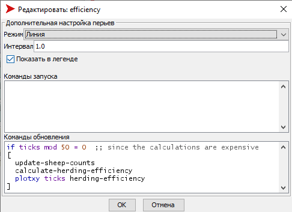
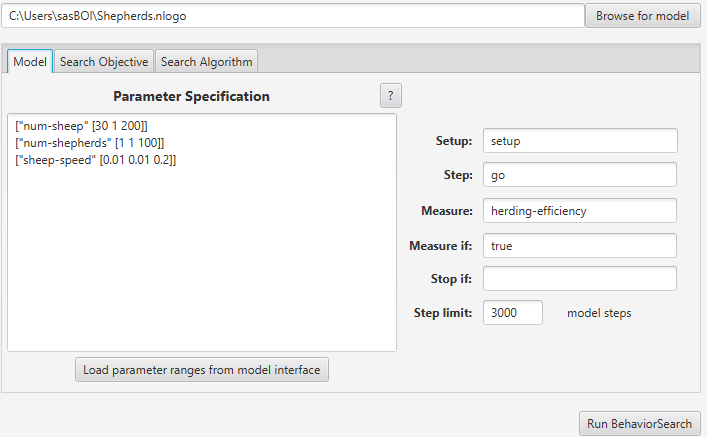
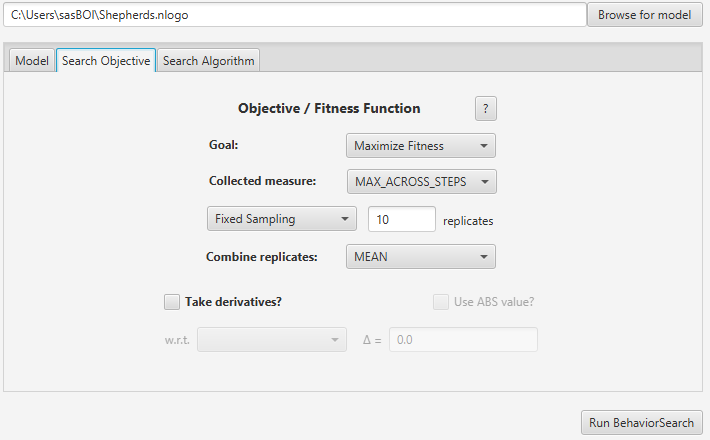
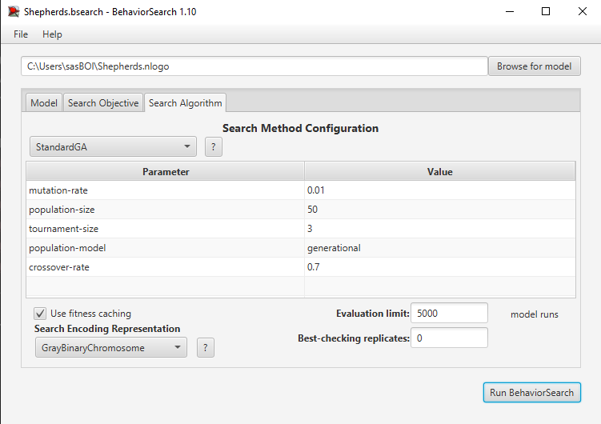
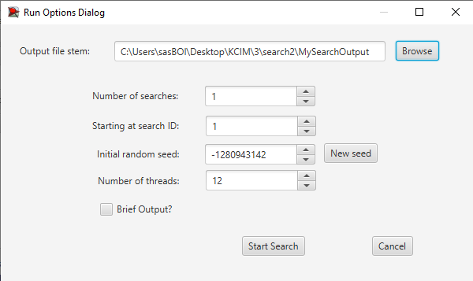
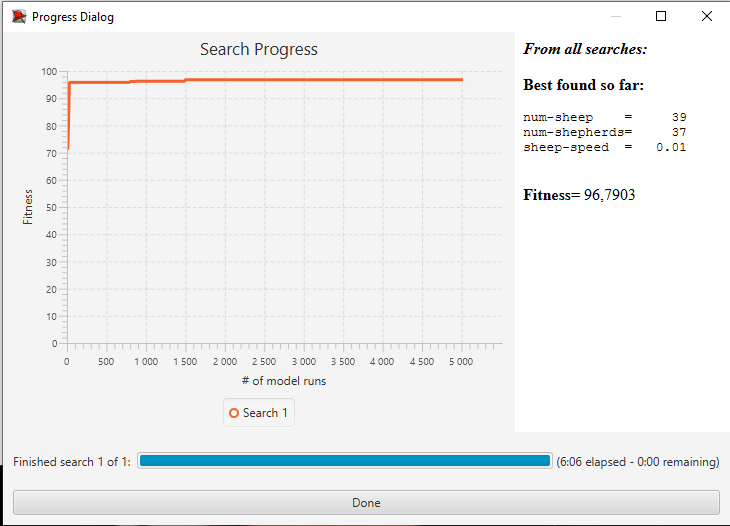
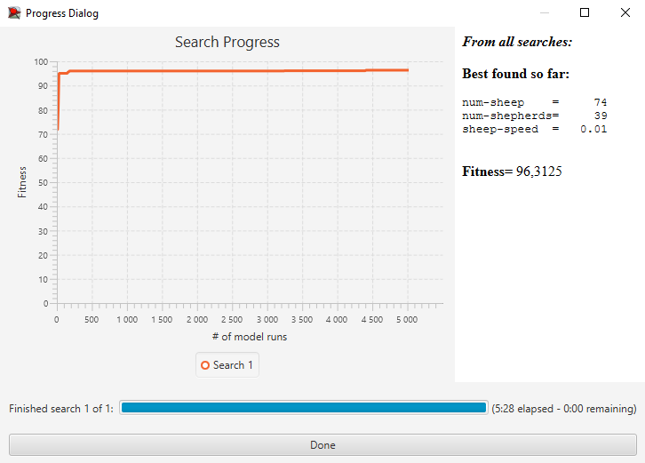

## Комп'ютерні системи імітаційного моделювання
## СПм-22-3, **Захаров Даніїл Олександрович**
### Лабораторна робота №**3**. Використання засобів обчислювального интелекту для оптимізації імітаційних моделей

 

### Варіант 9, модель у середовищі NetLogo:
[Sheperds](http://www.netlogoweb.org/launch#http://www.netlogoweb.org/assets/modelslib/Sample%20Models/Biology/Shepherds.nlogo).

 

#### Вербальний опис моделі:
У цьому проекті вівці безладно блукають, а пастухи ходять, намагаючись їх випасати. Чи опиняться вівці в одному стаді, залежить від кількості пастухів і від того, наскільки швидко вони рухаються порівняно з вівцями. Кожен пастух блукає випадковим чином і якщо він натикається на вівцю, він підбирає вівцю та продовжує безладно блукати. Коли він натикається на іншу вівцю, він знаходить вільне місце поблизу, кладе свою вівцю та шукає іншу.

### Керуючі параметри:
- **num-shepherds** визначає кількість пастухів на полі.
- **num-sheep** визначає кількість овець на полі.
- **sheep-speed** визначає швидкість руху овець, тобто, кількість ділянок на які вівця перисунеться, на кожному ігровому такті, в випадковому напрямі.

### Показники роботи системи:
- **herding-efficiency**, тобто ефективність роботи пастухів. Ефективність утримання стада вимірюється тут шляхом підрахунку кількості ділянок, у яких немає овець:
ефективність = ділянки без овець / (кількість ділянок - кількість овець). 
Виражено у відсотках.

 

### Налаштування середовища BehaviorSearch:

**Обрана модель**:
<pre>
D:\NetLogo\models\Sample Models\Biology\Shepherds.nlogo
</pre>
**Параметри моделі** (вкладка Model):  
*Параметри та їх модливі діапазони були автоматично вилучені середовищем BehaviorSearch із вибраної імітаційної моделі, та виправлені для більшої реалистичності*:
<pre>
["num-sheep" [30 1 200]]
["num-shepherds" [1 1 100]]
["sheep-speed" [0.01 0.01 0.2]]
</pre>
*Діапазон кількості овець було знижено до 30 - 200 та діапазон кількості пастухів було знижено до 1 - 100, в порівнянні зі значенням за замовчуванням, для підвищення "реалістичності" моделі та більш коректного обчислення ефективності групування*  

**Використовувана міра**:  
Для фітнес-функції було обрано **значення максимальної ефективності групування**, вираз для її розрахунку взято з налаштувань графіка аналізованої імітаційної моделі в середовищі NetLogo  
  
та вказано у параметрі "**Measure**":
<pre>
	herding-efficiency
</pre>
Ефективность групування за весь період симуляції тривалістю, 3000 тактів.

Загальний вигляд вкладки налаштувань параметрів моделі:  

**Налаштування цільової функції** (вкладка Search Objective):  
Метою підбору параметрів імітаційної моделі, що описує дорожній рух двосмуговим шосе, є **максимізація** значення максимального значення ефективності групування – це вказано через параметр "**Goal**" зі значенням **Maximize Fitness**. Тобто необхідно визначити такі параметри налаштувань моделі, у яких ефективності групування найвища. При цьому цікавить не просто ефективності групування у якийсь окремий момент симуляції, а максимальне її значення за всю симуляцію. Для цього у параметрі "**Collected measure**", що визначає спосіб обліку значень обраного показника, вказано **MAX_ACROSS_STEPS**.  
Щоб уникнути викривлення результатів через випадкові значення, що використовуються в логіці самої імітаційної моделі, **кожна симуляція повторюється по 10 разів**, результуюче значення розраховується як **середнє арифметичне**. 

Загальний вигляд вкладки налаштувань цільової функції:  

**Налаштування алгоритму пошуку** (вкладка Search Algorithm):  
Загальний вид вкладки налаштувань алгоритму пошуку:  

 

### Результати використання BehaviorSearch:
Діалогове вікно запуску пошуку:  

Результат пошуку параметрів імітаційної моделі, використовуючи **генетичний алгоритм**:  

Результат пошуку параметрів імітаційної моделі, використовуючи **випадковий пошук**:  

**Висновки**: 
Генетичний алгоритм продемонстрував більшу ефективність у знаходженні оптимальних параметрів (менше значення "num-sheep" і "num-shepherds" при вищому значенні ефективності).
Обидва методи знайшли параметри, які підвищили ефективність роботи пастухів утримання стада до значення близько 96%.